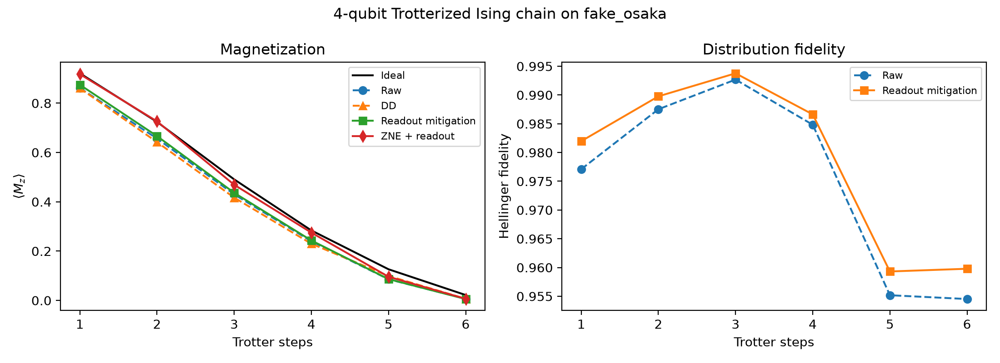

# NISQ Measurement Error Mitigation

Error-mitigation techniques for noisy intermediate-scale quantum (NISQ) processors, applied to Trotterized
quantum circuits and validated on IBM 127-qubit Eagle devices (IBM Kyoto, IBM Osaka).



## Techniques
| Technique | What it corrects | Implementation |
|---|---|---|
| **Measurement error mitigation** | readout bit-flips | calibration assignment matrix + constrained least squares (`mitigation.py`) |
| **Zero-noise extrapolation (ZNE)** | gate noise | global unitary folding (scale 1, 3, 5) + Richardson extrapolation |
| **Dynamical decoupling (DD)** | idle-qubit decoherence | X–X sequences in idle windows via `PadDynamicalDecoupling` |
| **T-REx** | readout (twirled) | via IBM Runtime `resilience_level=1` on hardware |

The runner automatically picks the best-calibrated chain of physical qubits (`layout.py`), avoiding broken
couplers and qubits with high readout error.

## Repository Structure
```
NISQ-Error-Mitigation/
├── Code/
│   ├── circuits.py          # Trotterized transverse-field Ising, GHZ
│   ├── mitigation.py        # readout mitigation, ZNE, dynamical decoupling, observables
│   ├── layout.py            # best-calibrated qubit chain selection
│   ├── run_experiments.py   # raw vs. mitigated comparison, writes Results/ and Figures/
│   └── requirements.txt
├── Dataset/                 # how data is generated (no external dataset)
├── Figures/                 # mitigation curves, readout assignment matrix
├── Results/                 # JSON outputs and summary tables
├── LICENSE
└── README.md
```

## Quick Start
```bash
cd Code
pip install -r requirements.txt
python run_experiments.py                         # local: FakeOsaka noise model
python run_experiments.py --backend ibm_kyoto     # real hardware (saved IBM Quantum account required)
```
To use real hardware, save your IBM Quantum credentials once:
`QiskitRuntimeService.save_account(channel="ibm_quantum_platform", token="<YOUR_TOKEN>")`.

## Publication
**Error Mitigation in the NISQ Era: Applying Measurement Error Mitigation Techniques to Enhance Quantum Circuit Performance**  
M. U. Khan, M. A. Kamran, **W. R. Khan**, M. M. Ibrahim, M. U. Ali, S. W. Lee.  
*Mathematics*, 12(14), 2235, 2024. DOI: [10.3390/math12142235](https://doi.org/10.3390/math12142235)  
Companion code by the first author: [mishaurooj/Quantum-Error-Mitigation-in-the-NISQ-Era](https://github.com/mishaurooj/Quantum-Error-Mitigation-in-the-NISQ-Era)

## Author
**Wajiha Rahim Khan**  
[Google Scholar](https://scholar.google.com/citations?user=ctvOkbYAAAAJ) · [Email](mailto:wajihakhan906@gmail.com)

## License
MIT. See [LICENSE](LICENSE).
